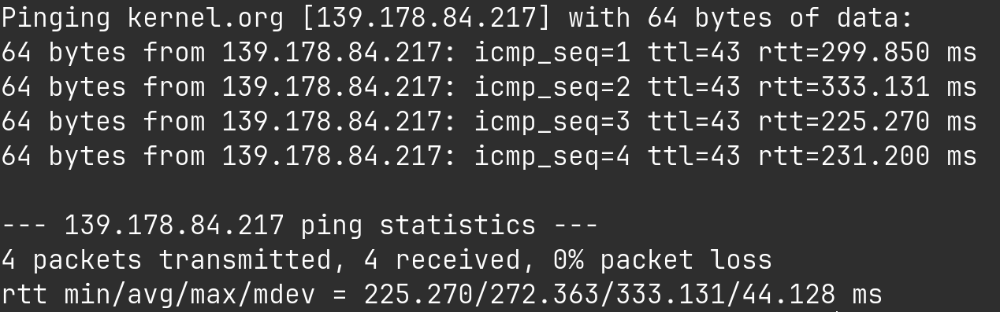
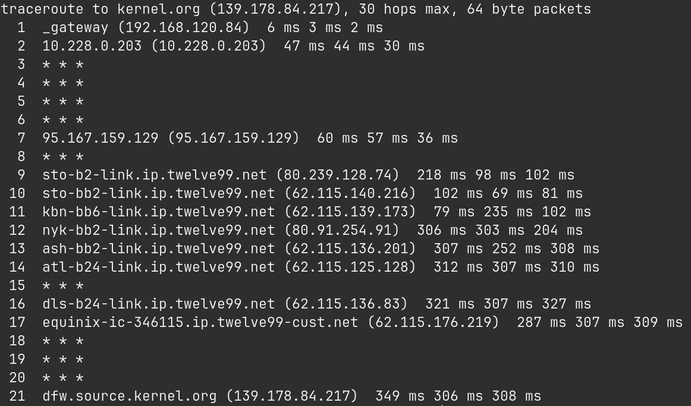

# ntool - multifunctional network analyser tool

## Ping


## Traceroute


## Installation

Clone this repository:
```console
git clone https://github.com/alkuzin/ntool.git
```

Move to `ntool/build/` & build makefile:
```console
cd ntool/build/ && cmake CMakeLists.txt
```

Build project:
```console
make all
```

Run this to get usage info. (**root rights required**):
```console
sudo ./ntool --help
```

## License
Multifunctional network analyser tool. Copyright (C) 2024 Alexander (@alkuzin).

This program is free software: you can redistribute it and/or modify it under the terms of the GNU General Public License as published by the Free Software Foundation, either version 3 of the License, or (at your option) any later version.

This program is distributed in the hope that it will be useful, but WITHOUT ANY WARRANTY; without even the implied warranty of MERCHANTABILITY or FITNESS FOR A PARTICULAR PURPOSE. See the GNU General Public License for more details.

You should have received a copy of the GNU General Public License along with this program. If not, see https://www.gnu.org/licenses/.